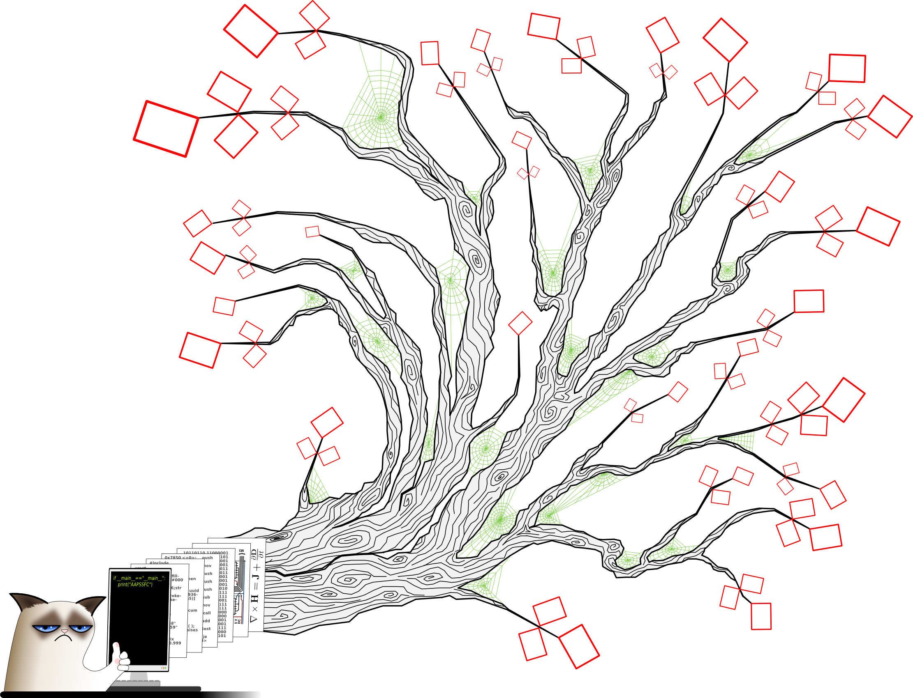

.. © 2015 Johann Dreo

.. |br| raw:: html

    

=================================================
Apprendre à programmer |br| (sans se faire chier)
=================================================

Introduction
############
.. toctree::
    :maxdepth: 2

    principes
    introduction
    python

Exemples par difficulté
#######################

.. Seul chapitre avec un niveau de TOC de 2

Jeux simples
============
.. toctree::
    :maxdepth: 2

    nombre
    pendu

Jeux de tableau
===============
.. toctree::
    :maxdepth: 1

Exemples par domaine
####################

Simulation
==========
.. toctree::
    :maxdepth: 1

    mounty_hall

Dessin procédural
=================
.. toctree::
    :maxdepth: 1

Intelligence artificielle
=========================
.. toctree::
    :maxdepth: 1

    pendu

Système
=======
.. toctree::
    :maxdepth: 1

Sécurité et réseaux
===================
.. toctree::
    :maxdepth: 1

Exemples par concept
####################

Boucles imbriquées
==================
.. toctree::
    :maxdepth: 1

Récursivité
===========
.. toctree::
    :maxdepth: 1

Aléatoire
=========
.. toctree::
    :maxdepth: 1

    mounty_hall

Graphes
=======

Exemples par approche
#####################

Programmation impérative
========================
.. toctree::
    :maxdepth: 1

    nombre
    mounty_hall

Programmation fonctionnelle
===========================
.. toctree::
    :maxdepth: 1

    pendu

Programmation Objet
===================
.. toctree::

